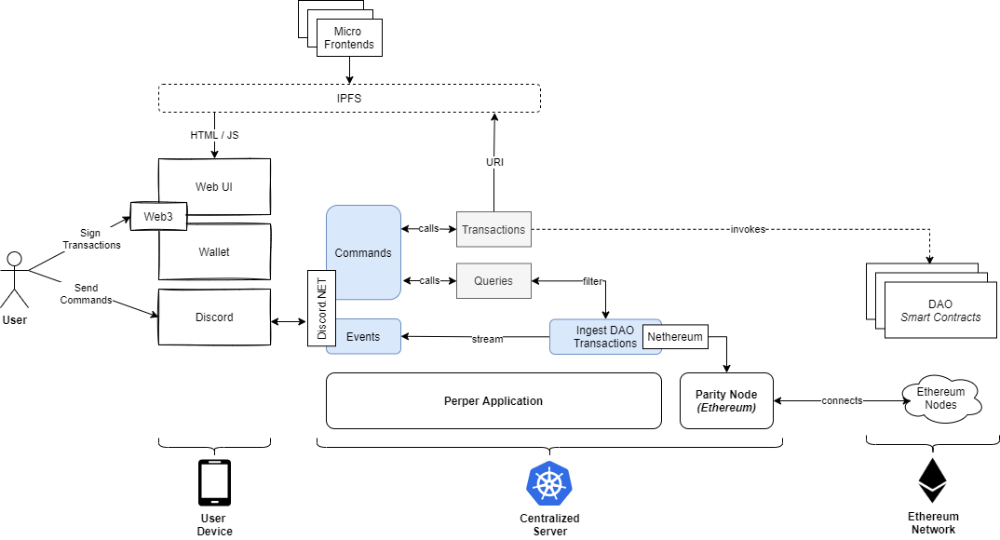

# Architecture Overview
The document describes the overall architecture of Apocryph Discord Bot, 
including its modules, dependencies, technology choices and patterns.
It is highly recommended read for anyone interested in contributing to the
Apocryph Discord Bot.

## Diagram

## Modules
Apocryphh Discord Bot is broken down into three main modules:
1. Core - .NET 5.0 application based on Perper responsible for bot logic
2. Frontend - HTML / JS micro-fronteds used for presenting more complex data / interactions
3. Ethereum - Etheremum Parity Node used to send transactions and execute queries to Ethereum network

### Core
The core modules is implemented as a singe Perper Agent with the following streams:
1. Commands - using Discord.NET ingests slash commands from the bot
2. Events - using Discord.NET publishes events to the events channel
3. Voting - using Discord.NET publishes voting notifications to the voting channel
4. Ingest DAO Transactions - using Nethereum ingest Apocryph DAO related transactions in
Perper Fabric.

In addition to the streams we also have:
1. Queries - various filters on top of the ingested transaction data
2. Transactions - front-end controller generating IPFS URIs for singing transactions

### Frontend
Number of single page micro-applications based on HTML and Vue.js

### Ethereum 
Etherem parity node used as connection to Ethereum Network.

## Operations
The Core and the Ethereum modules are packaged as containers and 
are orchestrated using Kubernetes. The Frontend module is deployed 
and served using IPFS.

### Local Development
For local development purpose, it is recommended to use Docker and 
Docker Compose to launch the whole system on your development machine.